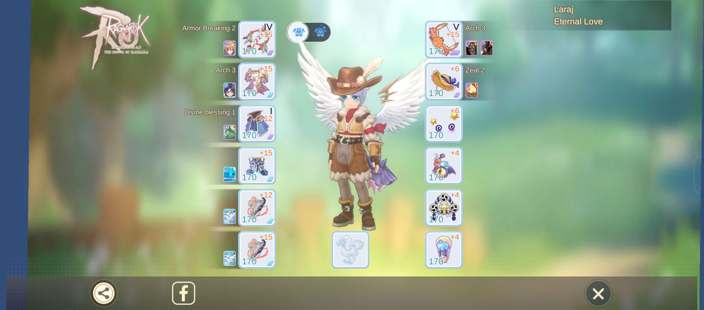
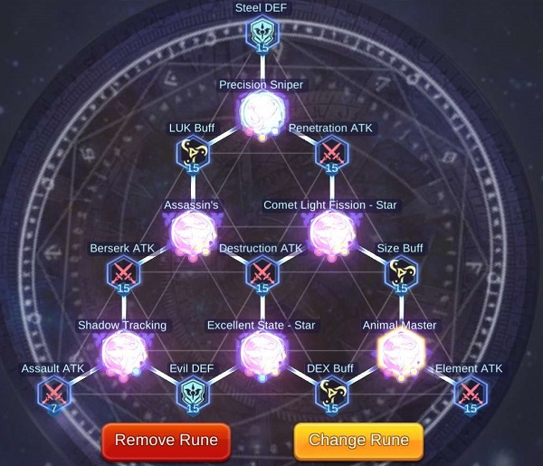
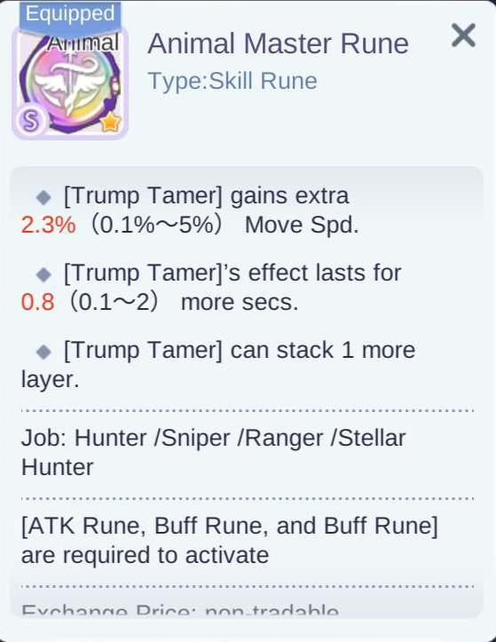

### PvE - Build AA Crit 

### Stats

<table width="100%" border="1" cellspacing="1" cellpadding="1" >
<tr><td>
<b>Stat</b>
 </td>
<td>
<b>Montant</b>
 </td>
<td>
<b>Infos</b>
 </td></tr>
<tr><td>
<b>Critical</b>
 </td>
<td>
165
 </td>
<td>
Pour instances Legend
 </td></tr>
<tr><td>
<b>Critical DMG</b>
 </td>
<td>
300-315%
 </td>
<td>

 </td></tr>
</table>

### Skills

Coming Soon

### Stuff

### Shadow Equipments & Relics

Coming Soon

### Runes

  

*&nbsp;*{: .fa .fa-info-circle}

{: .callout-title}
#### Note importante

Les trois runes suivantes sont indispensables pour assurer un maximum de DPS.

