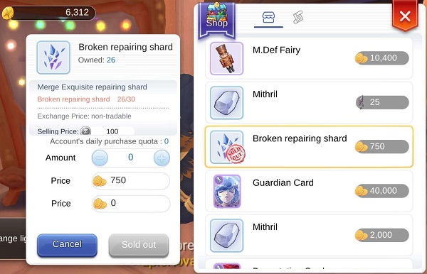
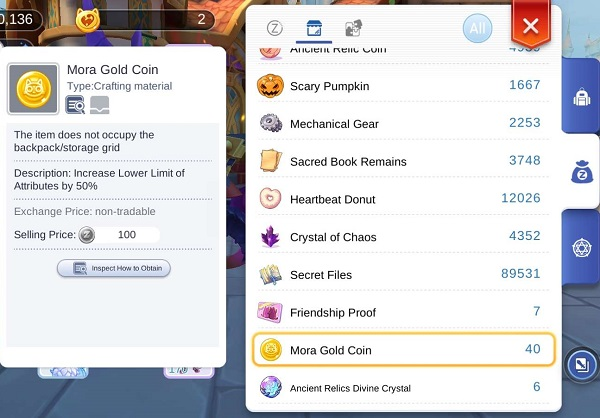
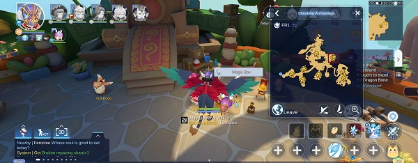
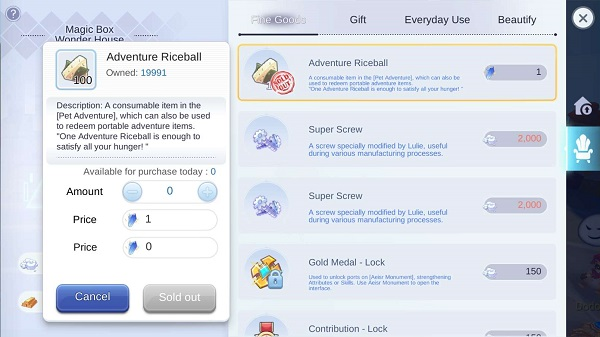
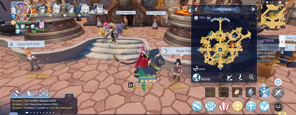
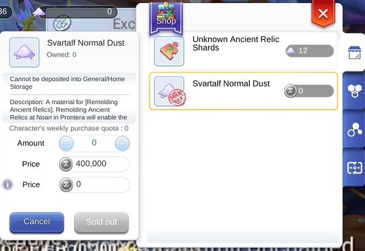
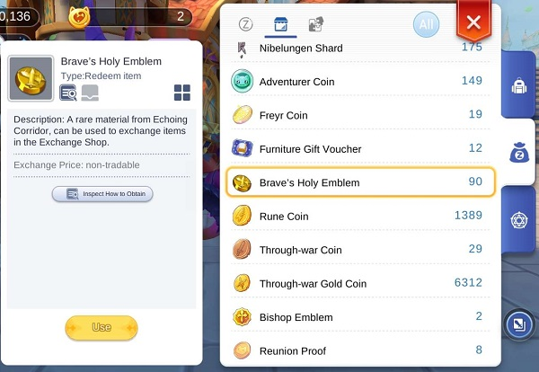

## Armoire de Guilde
 

 Si vous avez des honnor proof réstant après vos achats de <b>20 Praying Cards</b>, sa peut etre intéréssant de prendre <b>1x Broken Repairing Shard</b> par jours, cela vous permettra d'avoir un crystal pour reparer des hat par mois.

 

## Musique
 
TO DO

## Tableau de Quêtes
 

A faire sur les 3 persos du comptes, la daily quest est repetable sur chaque perso se qui vous recompense de mora coin. Vous pouvez utiliser des <b>Adventure Riceball</b> pour accomplir ces quetes instantanément.

## Pierre d'enchantement
 

Dans la boutique d'enchant vous pouvez acheter des pierres pour acheter des ticket d'enchantement. Libre a vous du jusqu a quel prix vous etes prêt a les acheter, personellement je prend le premier a 30 mora gold, et les 2 prochains a 45 mora gold.

 

## Food
 

Chaque jour rendez vous à la cuisine pour faire la daily quest qui vous demande de faire un plat et de le rendre au NPC (souvent vous posseder deja le plat, donc parler lui directe pour voir si vous en avez un a rendre). Accomplir cette quête vous donnera 3 nouriture rare aléatoire.
 

 

Puis vider le shop de Rare item égallement.
 

 

 

*&nbsp;*{: .fa .fa-thumbs-up}

{: .callout-title}
#### Tips

Cette daily quest et les achats de rare item est très importante. A ne vraiment pas négliger. Plus vous progresserez dans le jeu, plus vous serrez en manque de food, c'est pourquoi il ne faut surtout pas négliger la partie cuisine des daily quest

## Cloud Sea Archipelago
 

Vous pouvez acheter <b>100 Adventure Riceball</b> par jours en utilisant les <b>Fantasy Crystal</b>

 

 

## Runes Shop
 

Libre de vos choix, mais ne dépenssez pas les Gold Medals / Contributions temps que votre Aesir n'est pas au maximum.

 

## Relics Shop
 

Si vous avez pas mal de Zeny, vous pouvez prendre <b>24x Svartalf Normal Dust</b> pour les relics

 

## Brave Holy Emblem Shop
 

A vos choix! Personellement j'opte pour les 2 runes Star, 10x oracle mirror crystal et le reste en praying cards

 

