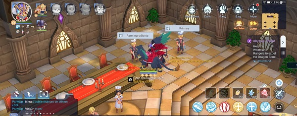
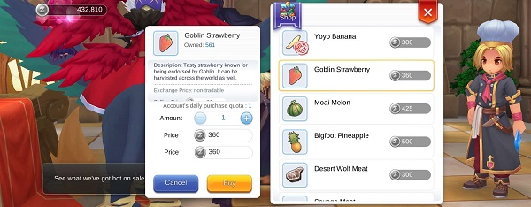

## Food
 

Chaque jour rendez vous à la cuisine pour faire la daily quest qui vous demande de faire un plat et de le rendre au NPC (souvent vous posseder deja le plat, donc parler lui directe pour voir si vous en avez un a rendre). Accomplir cette quête vous donnera 3 nouriture rare aléatoire.
 

 

Puis vider le shop de Rare item égallement.
 

 

 

