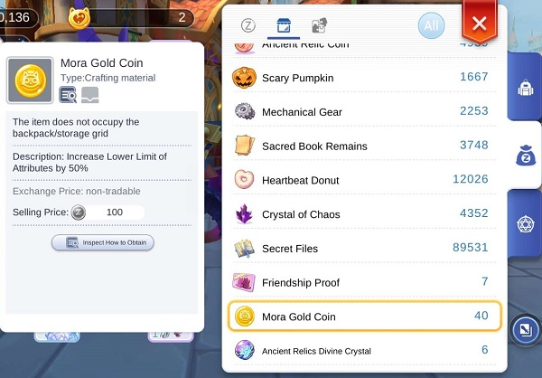
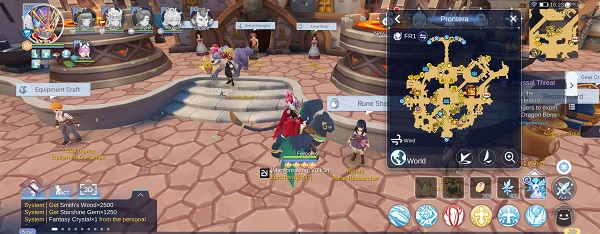
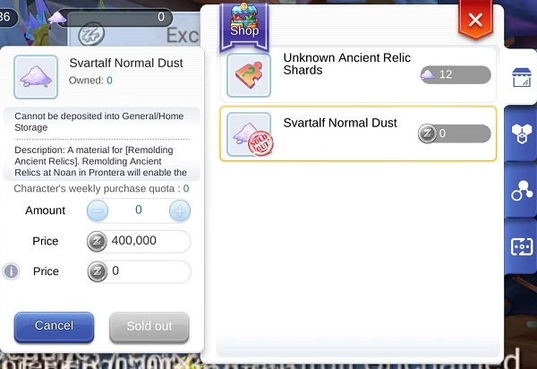

## Les Weekly
 

## Un gros pack de Recharge
 

Dans le menu <b>Recharge</b>, vous trouverez chaque semaines (reset chaque Lundi matin) un pack aléatoire normalement achetable en BCC, mais cette fois ci achetable en Zeny.

 

## Fortune Coins
 

Ahhhh les Fortune Coins! Monnaie qui nous permet de roll une récompense supplémentaire lors des donjons (en cliquant sur le petit dès une fois proposer).

Vous pouvez vous en procurrez 15 par semaines en les achetant via vos monnaies boullettes de riz.

 

## Armoire de Guilde
 

Dans l'armoire de guilde il est important d'acheter vos <b>20 Praying Cards</b> pars semaines (si vous arrivez à cumuller assez d'honnor proof)

## Cloud Sea Archipelago
 

Libre de vos choix, personellement je prend les Runes, les mora et les poudres de relics, les deux pieces pour forger du stuff peuvent etre interessante aussi

## Pierre d'enchantement
 

Dans la boutique d'enchant vous pouvez acheter des pierres pour acheter des ticket d'enchantement. Libre a vous du jusqu a quel prix vous etes prêt a les acheter, personellement je prend le premier a 30 mora gold, et les 2 prochains a 45 mora gold.

 

## Runes Shop
 

Libre de vos choix, mais ne dépenssez pas les Gold Medals / Contributions temps que votre Aesir n'est pas au maximum.

 

## Relics Shop
 

Si vous avez pas mal de Zeny, vous pouvez prendre <b>24x Svartalf Normal Dust</b> pour les relics

 

## Brave Holy Emblem Shop
 

A vos choix! Personellement j'opte pour les 2 runes Star, 10x oracle mirror crystal et le reste en praying cards

 

